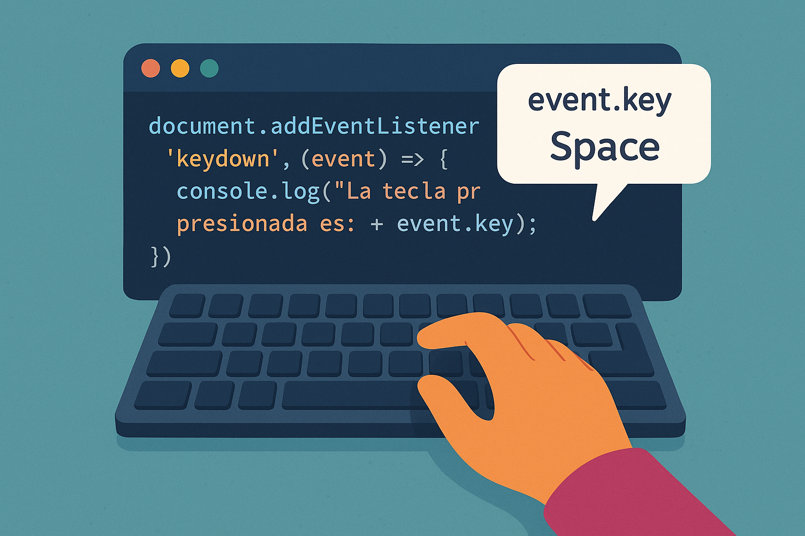

<div style="text-align:justify">

# JavaScript - Eventos Teclas.

<div style="text-align:center">



</div>

El evento `keydown` se dispara cuando se presiona una tecla del teclado. A diferencia del evento `keypress`, que se limita a las teclas que generan caracteres visibles, el evento `keydown` se dispara para todas las teclas, incluyendo las teclas de control como `Shift`, `Ctrl`, `Esc`, `Tab`, entre otras.

## Escuchar eventos:

Para capturar y responder a un evento, debes `escuchar` dicho evento en un elemento específico del `DOM`*Document Object Model*. Esto se hace mediante la función `addEventListener`.

**addEventListener**

La función `addEventListener` es una herramienta esencial en *JavaScript* para manejar eventos y crear interactividad en tus páginas WEB. Permite vincular funciones, conocidas como `manejadores de eventos`, a elementos **HTML** específicos para responder a diferentes tipos de acciones realizadas por el usuario.

## Uso `keydown`:

En este ejemplo, evento `keydown` se escucha en el elemento **body** y mostrará en a consola del navegador la tecla presionada.

```JavaScript
let body = document.querySelector('body');
body.addEventListener('keydown',(event)=>{
    console.log(`La tecla presionada es:${event.key} `);
})

```
En:
```JavaScript
let body = document.querySelector('body');
```
Estamos seleccionando el elemento **body** del documento **HTML** y guardándolo en la variable body.

En:
```JavaScript
body.addEventListener('keydown',(event)=>{});
```
Estamos agregando un `escuchador de eventos` al elemento body que espera el evento `keydown`. Cuando se produce el evento `keydown`*cuando una tecla del teclado es presionada*, se ejecuta el código dentro de la función que sigue.

Dentro de la función, utilizamos `console.log()`para imprimir en la consola del navegador un mensaje que indica qué tecla se ha presionado. La propiedad `key` del objeto de evento contiene el valor de la tecla presionada.

```JavaScript
console.log(`La tecla presionada es: ${event.key}`);
```
## Propiedades del evento `keydown`:

Cuandoo se dispara el evento `keydown`, se genera un objeto de evento que contiene varias propiedades útiles:

`key` El valor de la tecla que se presionó (*ej. a, Enter*)

`code` El código físico de la tecla (*ej KeyA, ArrowDown*)

`altKey` Booleano que indica si la tecla *Alt* estaba presionada.

`ctrlKey` Booleano que indica si la tecla *Control* estaba presionada.

`shiftKey` Booleano que infica si la tecla *Shift* estaba presionada.

## Listado de eventos teclas:

- `keydown` Se dispara cuando se presiona una tecla. Este evento se activa inmediatamete cuando se presiona la tecla, antes de que se procese cualquier otro comportamiento.

- `keypress` Este evento se disparaba cuando se presionaba una tecla que podía generar un carácter *es decir, una tecla alfanumérica*. Sin embargo, este evento está obsoleto en favor de `keydown` y `keyup`.

- `keyup` Se dispara cuando se suelta una tecla que había sido presionada previamete. Este evento se activa una vezque la tecla se libera.

</div>